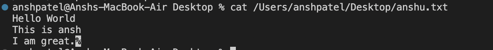

# Lab Report 1 - Remote Access and FileSystem (Week 1)

In this lab report, we will explore basic filesystem commands, including `cd`, `ls`, and `cat`.

## `cd` Command

### Example 1: Using `cd` with No Arguments
```bash
$ cd

## Working Directory: This command does not change the working directory. In the given example, I am in the home directory (/Users/anshpatel). 
## Output Explanation: When 'cd' is used without arguments, it takes you to your home directory. If we are in the home directory, there would be no change. If not, we will go back to the previous directory if cd is used without any commands. There would not be any kind of error. 


$ cd /path/to/directory

## Working Directory: The working directory changes to /path/to/directory. Initially I am in the home directory (/Users/anshpatel). 
## Output Explanation: Using cd with a path as an argument navigates you to the specified directory. It seems that my working directory changes to Documents (/Users/anshpatel/Documents). There seems to be no error when ran.


$ cd /path/to/file
## Working Directory: The working directory changes to /path/to/directory. Initially I am in the home directory (/Users/anshpatel). 
## Output Explanation:I used /Users/anshpatel/Downloads/PA8.pdf, but received the following error for the output.


$ cd /nonexistent/directory

## Working Directory: The working directory remains unchanged.
## Output Explanation: This results in an error because /nonexistent/directory does not exist.
 


$ ls

## Working Directory: This command lists files and directories in the current working directory (/Users/anshpatel).
## Output Explanation: The output will display the files and directories in the current directory. There would no errors, it just displays the contents of the current directory.
 

$ ls /path/to/directory

## Working Directory: The working directory remains unchanged.I was initially in the home directory (/Users/anshpatel)
## Output Explanation: Upon using the directory, (/Users/anshpatel/Desktop) along with ls, I got the contents of Desktop directory with no errors.


$ ls /path/to/file

## Working Directory: The working directory remains unchanged.I was initially in the home directory (/Users/anshpatel)
## Output Explanation: Upon using the directory, (/Users/anshpatel/Desktop/IMG_7004.heic) along with ls, I entered that specific directory, but there were no content outputs or errors.


$ ls /nonexistent/directory

## Working Directory: The working directory remains unchanged. Initially I am in the home directory  (/Users/anshpatel).
## Output Explanation: This results in an error because /nonexistent/directory does not exist.


$ cat

## Working Directory: This command does not change the working directory (/Users/anshpatel).
## Output Explanation: When cat is used without arguments, it waits for user input, and the behavior depends on user input. There are no errors.


$ cat /path/to/file.txt

## Working Directory: The working directory remains unchanged. It is initially /Users/anshpatel
## Output Explanation: This command displays the contents of the specified file. In this case, upon using (/Users/anshpatel/Desktop/anshu.txt), we get the below output without any errors.


$ cat /nonexistent/file.txt

## Working Directory: The working directory remains unchanged. It is initially in the home directory. (/Users/anshpatel)
## Output Explanation: This results in an error because /nonexistent/file.txt does not exist.
 

