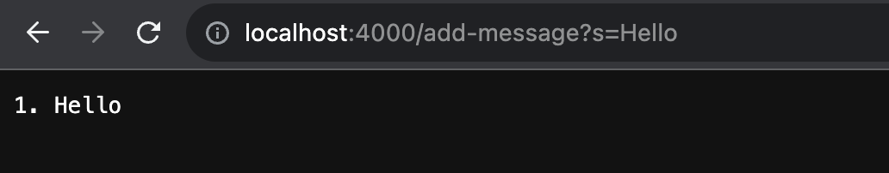
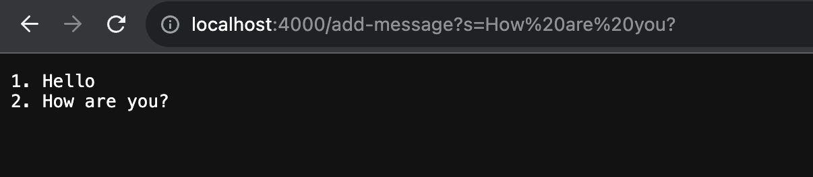
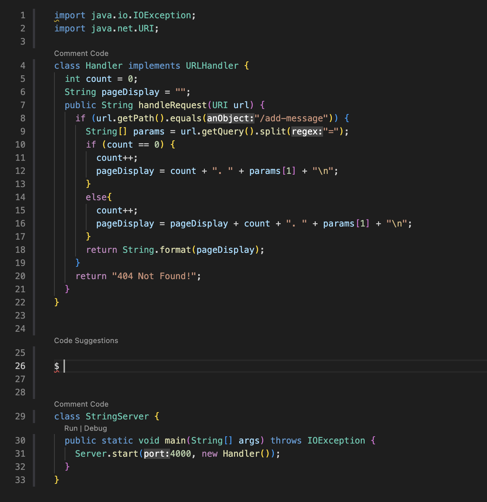
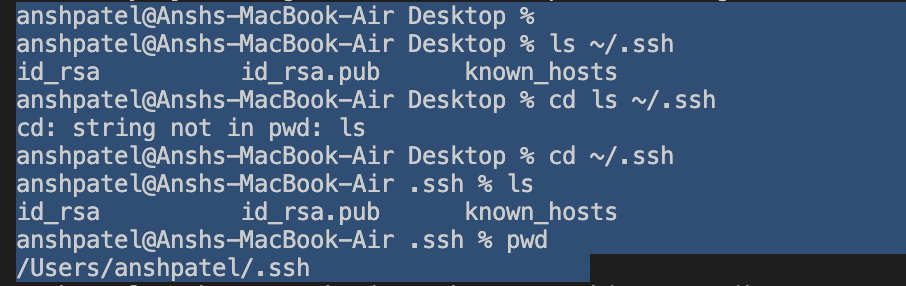

# Lab Report 2 - Servers and SSH Keys (Week 3)

## PART 1

the methods getPath() and getQuery() are used on an instance of the URI class to extract specific parts of the URI. 
getPath(): This method returns the path component of the URI. It is used to check if the path of the URI matches a specific string ("/add-message").

getQuery():This method returns the query component of the URI. It is used to extract the query part of the URI, which is then split based on the equals sign (=) to obtain the value after the s query parameter. The value is then displayed on the page.

First Screenshot (localhost:4000/add-message?s=Hello):
Methods called is handleRequest(URI url): This method of the Handler class is called when a request is made to the server.
Changes in Relevant Fields of the Class: Initially, count is 0. Since count == 0, the count gets incremented by 1.
pageDisplay: Initially, pageDisplay is an empty string. The value "1. Hello\n" is added to it based on the query parameter s with a value of "Hello".

Second Screenshot (localhost:4000/add-message?s=How%20are%20you?):
handleRequest(URI url): This method of the Handler class is called again when a new request is made to the server.
Changes in Relevant Fields of the Class: From the previous display, count was 1. Since count is not 0 now, the count gets incremented by 1 again, making it 2. pageDisplay had the value "1. Hello\n". Now, the value "2. How are you?\n" is appended to it, resulting in the updated pageDisplay value of "1. Hello\n2. How are you?\n".
---

##PART 2

---

##PART 3

During week 2, I learnt about remotely connecting to a server remotely which I was not aware of before. Moreover the port system was new to me as well. 

