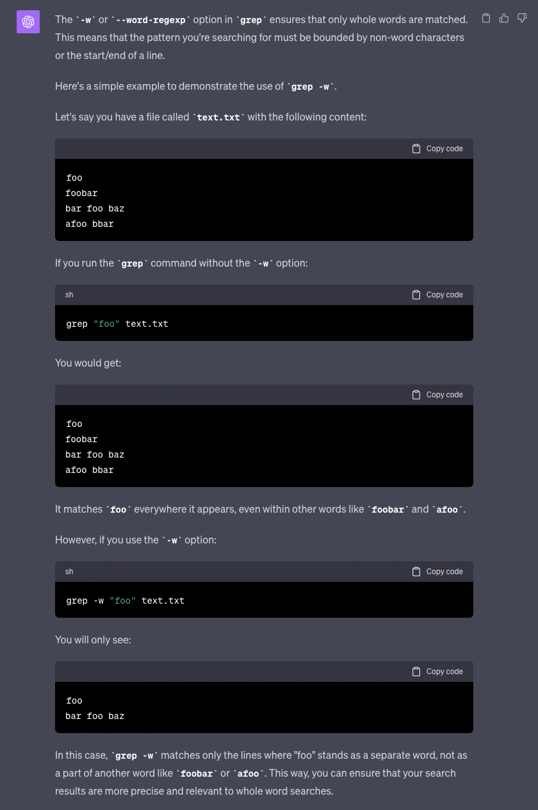

# LAB REPORT 3
---
the lab report shows the concept of bugs and explores the command line options for grep
## PART 1

### Failure-Inducing Input:

```
@Test
public void testGetFiles_Failure() throws IOException {
    File start = new File("some-files/even-more-files/");
    List<File> actualFiles = FileExample.getFiles(start);
    // This list should include all files in 'even-more-files' directory and its subdirectories
    List<File> expectedFiles = Arrays.asList(
        new File("some-files/even-more-files/d.java"),
        new File("some-files/even-more-files/a.txt")
        // Add other files if any subdirectories exist
    );
    assertEquals(expectedFiles, actualFiles);
}
```

### Non Failure-inducing input 
```
@Test
public void testGetFiles_Success() throws IOException {
    File start = new File("some-files/a.txt");
    List<File> actualFiles = FileExample.getFiles(start);
    // This list should only contain 'a.txt' as it is a file, not a directory
    List<File> expectedFiles = Collections.singletonList(
        new File("some-files/a.txt")
    );
    assertEquals(expectedFiles, actualFiles);
}

```

### Bug fix:
### Before:
```
static List<File> getFiles(File start) throws IOException {
    List<File> result = new ArrayList<>();
    result.add(start);
    if(start.isDirectory()) {
        File[] paths = start.listFiles();
        for(File subFile: paths) {
            result.add(subFile);
        }
    }
    return result;
}

```

### After:
```
static List<File> getFiles(File start) throws IOException {
    List<File> result = new ArrayList<>();
    if(start.isFile()) {
        result.add(start);
    } else if(start.isDirectory()) {
        File[] paths = start.listFiles();
        if(paths != null) {
            for(File subFile : paths) {
                result.addAll(getFiles(subFile));
            }
        }
    }
    return result;
}
```


## PART 2

# grep -c [word] [file you want to search the word in]

### FUNCTION: This is used to count the number of lines that match a pattern within input text given.
### USE: It helps us find out recurring words/phrases in a large data set.

## EXAMPLE 1
```
Anshs-Air:technical anshpatel$ grep -c "was" 911report/chapter-1.txt
165
```
## EXAMPLE 2
```
Anshs-Air:technical anshpatel$ grep -c "is" 911report/chapter-3.txt
1071
```

# grep -n [searched word] [file you want to search]

### FUNCTION: It is used to give the line number for each matching word.
### USE: It helps us the specific lines where the same words exist. This can save a lot of time.

## EXAMPLE 1
```
anshpatel@Anshs-Air technical % grep -n "clinicians" government/Alcohol_Problems/Session2-PDF.txt
406:unavailable, screening makes little sense to clinicians. Realizing
```
## EXAMPLE 2
```
anshpatel@Anshs-Air technical % grep -n "screening" government/Alcohol_Problems/Session2-PDF.txt
13:further examine and refine alcohol-screening questionnaires in the
15:and tests that constitute the best screening process. We need to
16:study barriers to screening, identify factors that promote
17:screening implementation, and demonstrate the impact of a screening
18:program in the ED. The final aim of screening must be improved
25:our own design of screening procedures, that we are clear about the
27:screening for several alcohol endpoints. Acute intoxication is of
32:screening tests identify patients with alcohol use disorders or
44:consumption occurs. Much of the emphasis of screening has shifted
55:Characteristics of an ideal ED screening test or sequence of
57:An ideal screening test would be accurate, practical, and
59:ways. For a screening test, high sensitivity is the most desirable
91:screening tests were developed outside the ED. Fortunately, many
97:studies of screening tests in the ED.7,8 An ideal test in the ED
101:In research trials, the impracticality of a screening test may
103:screening test to an already lengthy list of clinical care duties.
106:screening test will determine its success. Staff with any level of
118:factors may reduce the effectiveness of a screening procedure that
121:minutes). Most of the quest to develop efficient ED screening has
123:self-administered. An ideal screening test should not interfere
127:consequences to screening positive. Finally, the ideal test should
130:Currently available screening tests
131:Based on current evidence, screening should be undertaken using
148:consequence of screening only suspected patients. Gentilello
167:a brief screening tool for primary care providers to detect alcohol
189:Identification Test) in 1992 as a brief screening tool to detect
218:studied as a "screening test." D'Onofrio and others have
220:Studies of screening tests
221:Cherpitel conducted two studies comparing multiple screening
229:Soderstrom has compared multiple screening tests in a trauma
232:reviewed 38 studies of screening for alcohol use disorder in the
247:on these screening instruments improved sensitivity without loss of
249:maximize screening test performance.40
251:screening mainly in primary care settings. CAGE, AUDIT, and TWEAK
257:among white women. We must be careful not to employ screening
263:may need screening with modified or unique tests. Standard screens
266:cut points or use of alternative screening tests may be necessary
289:screening tests for ED patients.
290:Research questions: improving existing screening
313:more information. A trial of screening tests in various formats
317:The most motivational screening test is unknown. Drawing blood
322:immediate feedback may help make the transition from screening to
326:Research questions: finding the best approach to screening
337:To determine the best sequence for screening, the approach
347:screening and intervention program. Some questions or screens may
349:referral and treatment. Much of the screening literature is
351:evaluation of screening linked to intervention protocols.
352:Barriers to implementing screening
359:There are multiple barriers to screening. Nurses identified lack
364:screening and counseling of ED patients.67 The authors reported
369:barriers to implementing screening in clinical practice.
370:Currently, screening is a research tool, not a clinical tool. ED
371:staff does not use structured questionnaires for alcohol screening.
372:ED staff has no systematic approach to alcohol screening. Staff
376:Universal screening is appropriate in populations with high case
383:screening on some of the highest-risk groups or screening with
385:Implementing screening in clinical practice
386:Any ED staff member could be assigned the screening task.
388:conduct screening. We do not know which staff group will be most
398:is needed most since screening instruments have been used by
400:Impact of screening
402:screening programs. A major limit to realizing this improvement is
406:unavailable, screening makes little sense to clinicians. Realizing
407:a gain from screening in an ED is entirely dependent upon linking
408:the screening program to some form of counseling, onsite or through
409:referral services. The impact of screening should be demonstrated
413:benefits of screening: increased referrals, more patients receiving
416:Summary: research areas of interest concerning screening
420:screening tools in the ED. The sequence of screening tests needs to
423:practice. Barriers to screening in clinical practice must be
424:identified and removed. Studies of implementation of screening
426:of screening on referral and intervention, as well as outcomes such
444:Alcohol Use Disorders Identification Test in screening trauma
452:8. Cherpitel C. Comparison of screening instruments for alcohol
475:16. Isaacson J, Butler R, Zacharek M, Tzelepis A. A screening
481:18. Cyr M, Wartman S. The effectiveness of routine screening
484:screening in an ambulatory care setting. J Stud Alcohol
487:screening questionnaire. Alcohol 1991;26:81-91.
499:validation of a new alcohol screening instrument. Am J Psychiatry
529:35. Cherpitel C. A brief screening instrument for problem
532:36. Cherpitel C. Differences in performance of screening
537:Alcohol Use Disorders Identification Test in screening trauma
543:screening instruments for identifying harmful drinking and alcohol
546:40. Cherpitel C. Analysis of cut points for screening
550:screening questionnaires in women. JAMA 1998;280:166-71.
595:55. Heck E. Developing a screening questionnaire for problem
605:screening measure for problem drinking among female college
607:59. Werner M, Adger H, Jr. Early identification, screening, and
613:Alcoholism screening in the elderly. J Am Geriatr Soc
623:screening. Arch Intern Med 1996; 156:1150-6.
629:encountered with opportunistic screening for alcohol-related
```
# grep -w [searched word] [file]

### FUNCTION: This is when you want to match just the whole words rather than including substrings.
### USE: It helps us when there are words that could include frequently used substrings.

## EXAMPLE 1
```
anshpatel@Anshs-Air technical % grep -w "General" plos/journal.pbio.0020001.txt                 
        Kofi Annan, the Secretary-General of the United Nations, recently called attention to
```
## EXAMPLE 2
```
anshpatel@Anshs-Air technical % grep -w "electronic" plos/journal.pbio.0020010.txt
        electronic format. Few libraries have discarded the volumes digitised in JSTOR, but many
        but electronic holdings have increased. So a space-saving service became an access
        electronic versions of thousands rather than hundreds of titles, both current and
        the history of electronic publication through a minute examination of the process leading
        availability of electronic content—has become closer, and JSTOR's success has encouraged
        Schonfeld does not draw out is the pace of change in electronic publishing, and if so much
```
# grep -r [searched word] [directory]

### FUNCTION: This is when you want to search for matching patterns in all directories and subdirectories within the mentioned dir.
### USE: It helps us when there are words that could exist in multiple directories.

## EXAMPLE 1
```
anshpatel@Anshs-Air technical % grep -r "poison" biomed 
biomed/1476-069X-2-2.txt:        Yucheng and Yusho poisonings, when rice oil used for
biomed/gb-2003-4-5-r32.txt:          4 poisoning, but have been shown to
biomed/ar321.txt:        other DNA topoisomerase poisons known to induce NF-κB [
biomed/1471-2369-3-10.txt:        frequency of hospitalizations for poisonings (drug overdose
biomed/1471-2369-3-10.txt:        have a higher risk of poisonings than the general
biomed/1471-2369-3-10.txt:        poisonings represents an opportunity to explore the
biomed/1471-2369-3-10.txt:        hospitalized poisonings on subsequent survival after renal
biomed/1471-2369-3-10.txt:        mortality associated with hospitalized poisonings after
biomed/1471-2369-3-10.txt:          for hospitalized cases of poisonings (based on
biomed/1471-2369-3-10.txt:          "history of poisonings." These diagnoses include
biomed/1471-2369-3-10.txt:          hospitalization for poisonings after the first renal
biomed/1471-2369-3-10.txt:          of poisonings, especially since the USRDS database has no
biomed/1471-2369-3-10.txt:          primary discharge diagnosis for poisonings were extracted
biomed/1471-2369-3-10.txt:          were excluded. Hospitalizations for poisonings occurring
biomed/1471-2369-3-10.txt:          and hospitalizations for poisonings were examined using
biomed/1471-2369-3-10.txt:          different impact on poisonings. The total cumulative dose
biomed/1471-2369-3-10.txt:          to poisonings, survival time was defined as the time from
biomed/1471-2369-3-10.txt:          poisonings, with patients censored at death, loss to
biomed/1471-2369-3-10.txt:          development of hospitalization for poisonings were
biomed/1471-2369-3-10.txt:          plots of time to hospitalized poisonings after renal
biomed/1471-2369-3-10.txt:          hospitalized poisonings. In order to control for
biomed/1471-2369-3-10.txt:          hospitalizations for poisonings were uncommon, Poisson
biomed/1471-2369-3-10.txt:          Times after hospitalization for poisonings were entered
biomed/1471-2369-3-10.txt:        primary discharge diagnosis of poisonings during the study
biomed/1471-2369-3-10.txt:        incidence of hospitalizations for poisonings during the
biomed/1471-2369-3-10.txt:        for hospitalized poisonings are shown in Table 1. Suicide
biomed/1471-2369-3-10.txt:        patients hospitalized for poisonings, nor was attempted
biomed/1471-2369-3-10.txt:        of stay for patients hospitalized for poisonings was 4.05 ±
biomed/1471-2369-3-10.txt:        hospitalized poisonings was insulin/antidiabetic agents,
biomed/1471-2369-3-10.txt:        most common cause of hospitalized poisonings was
biomed/1471-2369-3-10.txt:        The time to hospitalization for poisonings is shown in
biomed/1471-2369-3-10.txt:        Figure 1. As shown, the risk of hospitalized poisonings
biomed/1471-2369-3-10.txt:        2and 3show the time to hospitalization for poisoning
biomed/1471-2369-3-10.txt:        3, the risk of poisonings for all transplant recipients was
biomed/1471-2369-3-10.txt:        hospitalized poisonings were low body mass index, graft
biomed/1471-2369-3-10.txt:        with reduced risk of poisoning. In Cox Regression analysis,
biomed/1471-2369-3-10.txt:        hospitalized poisoning were low body mass index and
biomed/1471-2369-3-10.txt:        poisonings.
biomed/1471-2369-3-10.txt:        Mortality after hospitalizations for poisoning, which
biomed/1471-2369-3-10.txt:        Hospitalizations for poisonings were independently
biomed/1471-2369-3-10.txt:        hospitalizations for poisonings after renal transplantation
biomed/1471-2369-3-10.txt:        though ICD9 codes 960-989.x also include poisonings from
biomed/1471-2369-3-10.txt:        hospitalizations for poisonings as a primary diagnosis were
biomed/1471-2369-3-10.txt:        not common, hospitalizations for poisonings were
biomed/1471-2369-3-10.txt:        common cause of poisonings in this population, as would be
biomed/1471-2369-3-10.txt:        14 ] . The frequent occurrence of poisonings due to
biomed/1471-2369-3-10.txt:        understandable. However, although the risk of poisonings
biomed/1471-2369-3-10.txt:        remarkable (Figure 1), and the risk of poisoning continued
biomed/1471-2369-3-10.txt:        of poisonings, as has been demonstrated for
biomed/1471-2369-3-10.txt:        cause of poisonings in this study. It is noteworthy that
biomed/1471-2369-3-10.txt:        The high frequency of poisonings due to
biomed/1471-2369-3-10.txt:        factor for poisonings in the present analysis. This
biomed/1471-2369-3-10.txt:        poisonings after renal transplantation were attributed to
biomed/1471-2369-3-10.txt:        poisonings in the present study, namely allograft rejection
biomed/1471-2369-3-10.txt:        risk factor for poisonings in this analysis as a risk
biomed/1471-2369-3-10.txt:        factor for hospitalized poisonings, independent of age,
biomed/1471-2369-3-10.txt:        The association of poisonings with allograft rejection
biomed/1471-2369-3-10.txt:        of poisonings and medication errors in the renal transplant
biomed/1471-2369-3-10.txt:        hospitalized poisonings. However, the study is population
biomed/1471-2369-3-10.txt:        reporting bias than case reports of poisonings in the
biomed/1471-2369-3-10.txt:        poisonings. In short, the possibilities of patient error
biomed/1471-2369-3-10.txt:        rejection with hospitalized poisonings in this analysis,
biomed/gb-2002-3-5-research0025.txt:          poisoning in humans [ 48]. 
biomed/1471-2458-2-21.txt:        skin disorders, allergic rhinitis, poisoning and toxic
biomed/cc1044.txt:        cardiovasculary diseases, poisons, polymedication and
biomed/gb-2001-3-1-research0001.txt:        metabolic component to water flux and the poisoning of
biomed/gb-2001-3-1-research0001.txt:          mercury poisoning of water flux in AtTIP2;1 (C116) and
biomed/1472-6793-1-2.txt:        responsible in part for Ciguatera seafood poisoning. In all
biomed/1472-6882-1-10.txt:          Elapidae family in Trinidad there are two poisonous coral
biomed/1472-6882-1-10.txt:          and poisonous. 
biomed/1472-6882-1-10.txt:          poisonous snakes, and is applied with cotton to snakebite
biomed/cc973.txt:        poisoning. Romera [ 27] demonstrated that GCS score
biomed/1471-2210-1-7.txt:        amnesic shellfish poisoning in humans, a condition that can
biomed/1471-2210-1-7.txt:        poisoning as one of the " 
biomed/1471-2210-1-7.txt:        ...five recognized fish poisoning
biomed/1471-2210-1-7.txt:        poisoning (FDA website:
biomed/1471-2210-1-7.txt:        of amnesic shellfish poisoning.
biomed/1472-6793-2-2.txt:        seafood poisoning, the identification of U73343 as a potent
```
## EXAMPLE 2
```
anshpatel@Anshs-Air technical % grep -r "sexuality" biomed/
biomed//1471-2466-1-1.txt:        homosexuality in 1 patient with small cell cancer and
biomed//1471-2466-1-1.txt:        develop in patients with HIV. Because homosexuality and
biomed//1471-2466-1-1.txt:        the PIP study, homosexuality was not a predominant HIV risk
```
## SOURCES USED

I gave the following questions to chatGPT:
q1. what does grep -r do
output:


q2. show example of grep -w
output:


