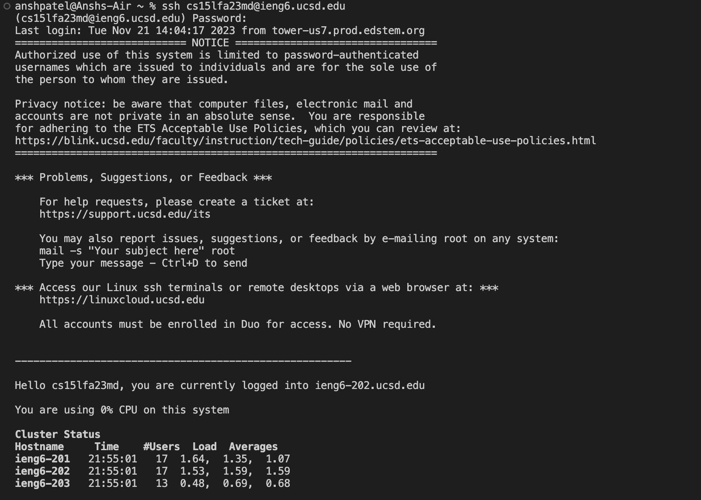
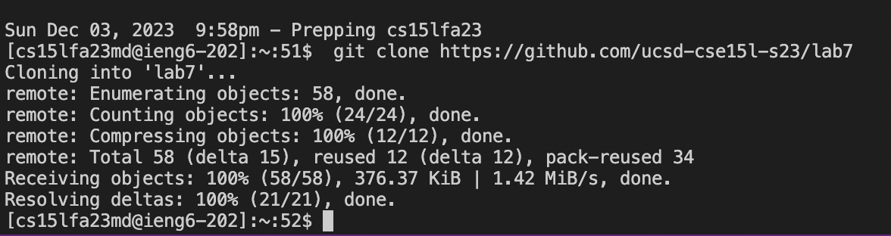
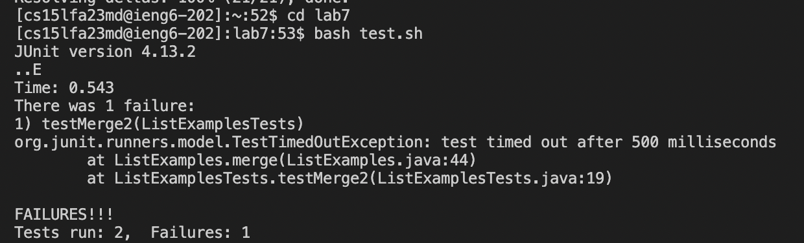
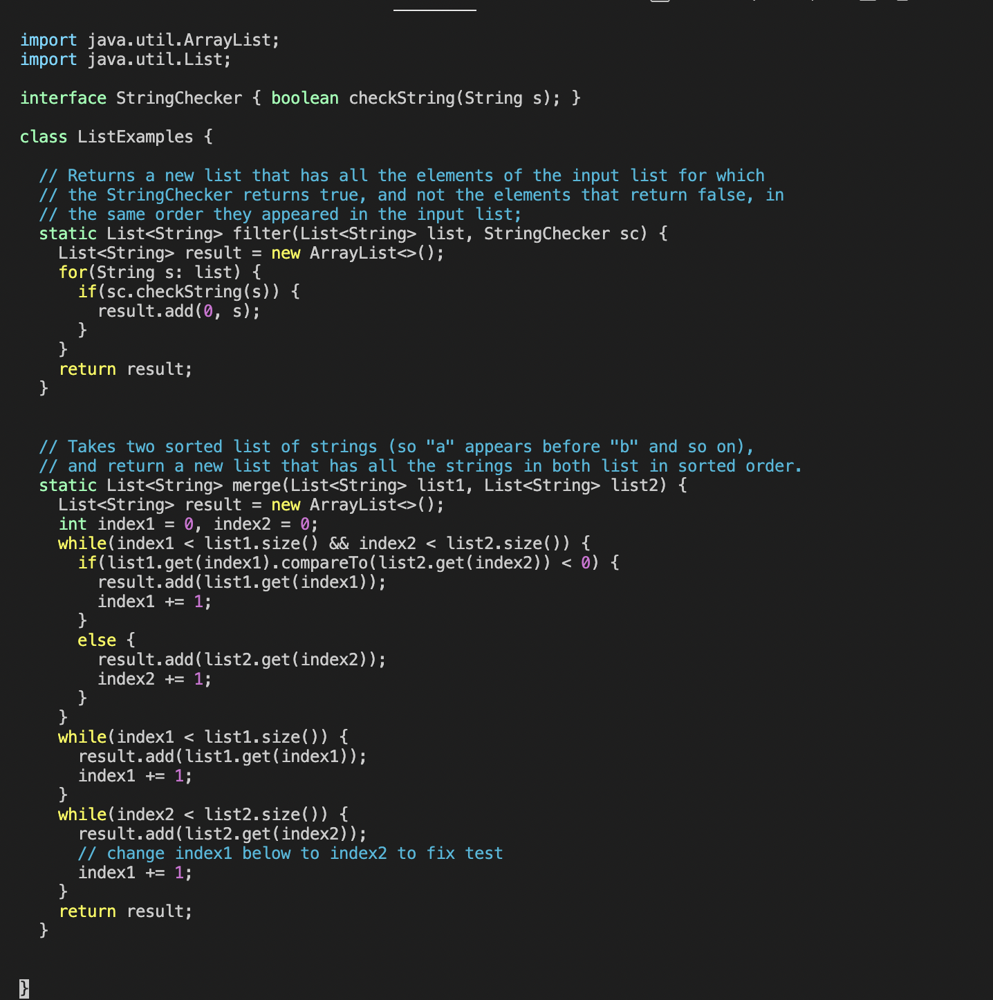
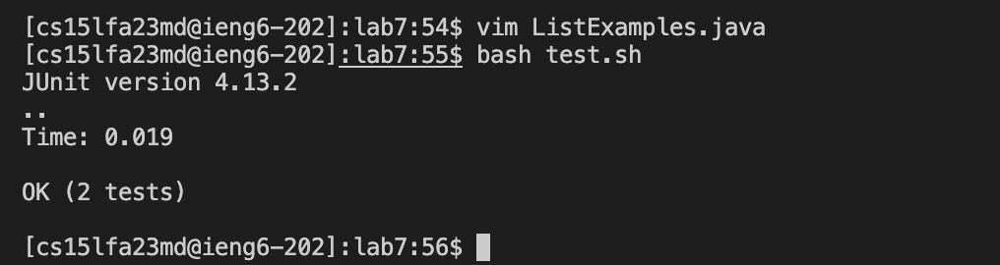
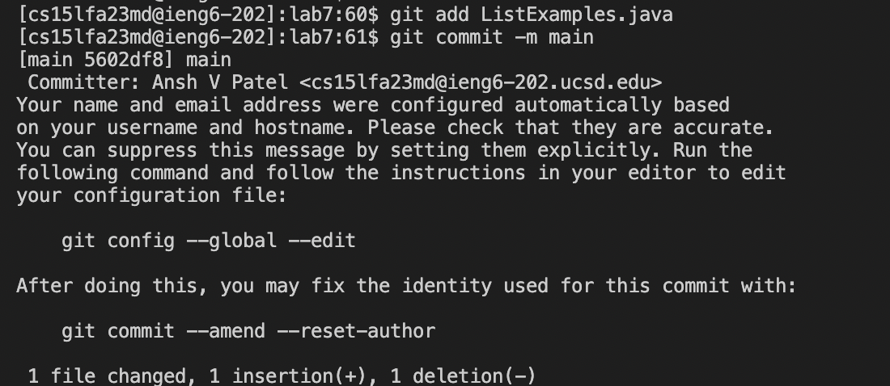

# Lab Report 4 - Vim (Week 7)

For the lab report this week, reproduce the task from above on your own. For each numbered step starting right after the timer (steps 4-9), take a screenshot, and write down exactly which keys you pressed to get to that step. For special characters like `<enter>` or `<tab>`, write them in angle brackets with code formatting. Then, summarize the commands you ran and what the effect of those keypresses were.

For example, when you run the tests, you might want to use the up arrow or Ctrl-R to access your bash history rather than typing in the full command with classpath, etc. You might say something like this accompanying the screenshot for running the tests:

## Logging into ieng and cloning the repository 
keys pressed: `ssh cs15lfa23md@ieng6.ucsd.edu and then <enter>` 

keys pressed: `git clone https://github.com/ucsd-cse15l-s23/lab7 and <enter>`

## Running the tests from lab 

Go to lab 7 using:
`cd lab7 and <enter>`
To run the tests, the following steops:
`bash test.sh then <enter>`

## Using vim to edit the code

In order to open the file in vim:
`vim ListExamples.java and <enter>`

Initially the cursor was at the bottom of the left side. It had to be to the place where change was needed. Then we need to delete "1" and replace it with "2" by going to insert mode. Lastly save the changes and quit:

`<up><up><up><up><up><up>11111111111`
`press x`
`i2 then <escape> :wp then <enter>`

## Re-running the tests

`bash test.sh and <enter>`

## Commit and push to GitHub account 

`git add ListExamples.java and then <enter>`
`git commit -m main <enter>`
`git remote add org git@github.com:anshuuuuuuuuu/lab7.git <enter>`
`git push org main`

